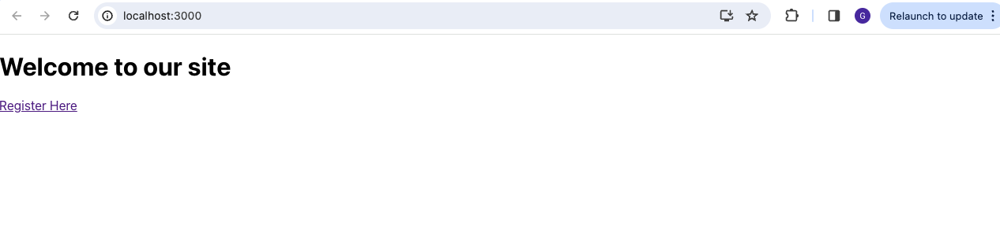
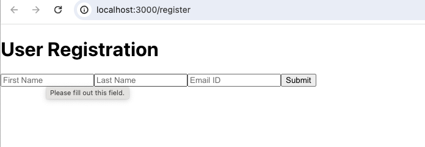
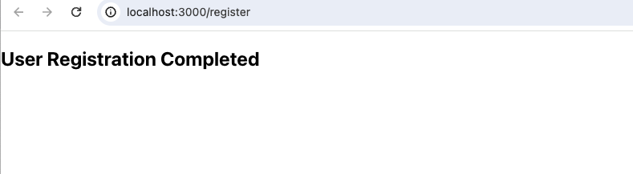

### Elevate Your Web Testing Game: Multi-Tab Testing with Cypress and Puppeteer Plugin

Cypress, renowned for its user-friendly approach to end-to-end testing, meets its match in the Puppeteer plugin, breaking the mold by enabling multi-tab test scenarios. This combination not only broadens your testing capabilities but also aligns with real-world user interactions, offering insights into the robustness of your web applications under varied conditions


## Prerequisites

@cypress/puppeteer plugin requires Cypress version 13.6.0 or greater.

Only Chromium-based browsers (e.g. Chrome, Chromium, Electron) are supported.

## Getting Started

To begin with 
1. Clone this repo
2. From the root of the repo, run below command to install the dependencies

```
npm install
```
### How Cypress is supporting Multitab ?

@cypress/puppeteer plugin has all the tooling required to integrate the Puppeteer with Cypress.

With this plugin we can now use a new command `cy.puppeteer()` which will execute the puppeteer code in the browser and the puppeteer code will be written in cypress.config.js{ts} file

If you want to use the plugin in existing repo, please install the below @cypress/puppeteer as dev dependency

```
npm install --save-dev @cypress/puppeteer
```

For typescript repository, please add the below types in `tsconfig.json` file

```
{
  "compilerOptions": {
    "types": ["cypress", "@cypress/puppeteer/support"]
  }
}
```

Add below import in the support/e2e.js{ts} file
```
import '@cypress/puppeteer/support'
```

Now we can add our puppeteer code in the cypress.config.js{ts} file.

The application we will be using in the repo as an example will have a landing page, which contains a link and clicking it opens a user registration form in new tab.

**Below will be our test validation**

1.Access the Landing Page </br>
2.Click on the User Registration Link </br>
 </br>
3.Switch to new tab and enter the user details </br>
 </br>
4.Submit the user form and Validate the success message </br>



## Code Explanation

Our cypress test will look like below

```

it("Multitab example using cypress-puppeteer", () => {
  cy.visit("/");
  cy.get("#registrationLink").should("have.text", "Register Here").click();
  cy.puppeteer("switchToNewTabAndRegisterUser").should(
    "equal",
    "User Registration Completed"
  );
});
```

**Code break down is as follows:**

Cypress command to visit the url

```
 cy.visit("/")
 ```

Cypress command to get the register link, validate the link's text and then click on the link
 ```
 cy.get("#registrationLink").should("have.text", "Register Here").click();
```

Below command is coming from Cypress Puppeteer plugin
```
cy.puppeteer("switchToNewTabAndRegisterUser").should(
    "equal",
    "User Registration Completed"
  );
```
This is similar to `cy.task()` where we pass the task name and with cy.puppeteer() we pass the message handler name which we are going to write it in `cypress.config.js` file and the message handler will return the success message once the user registration is completed.

Now let's write the message handler in `cypress.config.js` file and which will look like below

```
import { defineConfig } from "cypress";
import { Browser as PuppeteerBrowser, Page } from "puppeteer-core";
import { setup, retry } from "@cypress/puppeteer";

module.exports = defineConfig({
  e2e: {
    baseUrl: "http://localhost:3000/",
    setupNodeEvents(on, config) {
      // implement node event listeners here

      setup({
        on,
        onMessage: {
          async switchToNewTabAndRegisterUser(browser: PuppeteerBrowser) {
            const page = await retry<Promise<Page>>(async () => {
              const pages = await browser.pages();
              const page = await pages.find(page =>
                page.url().includes("register")
              );
              if (!page) {
                throw new Error("Could not find page");
              }

              return page;
            });

            await page.bringToFront();
            await page.waitForSelector("#firstname");
            await page.type("#firstname", "test");
            await page.type("#lastname", "test");
            await page.type("#email", "test@test.com");
            const submitButton = await page.$("#submit");
            await submitButton.click();
            const successMsg = await page.$eval(
              "#successMsg",
              el => el.textContent
            );
            submitButton.dispose();
            await page.close();
            return successMsg;
          }
        }
      });
    }
  }
});
```

### Code Walk through

We are importing below classes and functions 

```
import { defineConfig } from "cypress";
import { Browser as PuppeteerBrowser, Page } from "puppeteer-core";
import { setup, retry } from "@cypress/puppeteer";
```
Note that PuppeteerBrowser and Page are classes from `puppeteer-core` and setup, retry functions are from `@cypress/puppeteer`

we are going to use them in writing our Message Handler like below in the e2e config and within setupNodeEvents

```
e2e: {
    baseUrl: "http://localhost:3000/",
    setupNodeEvents(on, config) {
      // implement node event listeners here

      setup({
        on,
        onMessage: {
          async switchToNewTabAndRegisterUser(browser: PuppeteerBrowser) {
            const page = await retry<Promise<Page>>(async () => {
              const pages = await browser.pages();
              const page = await pages.find(page =>
                page.url().includes("register")
              );
              if (!page) {
                throw new Error("Could not find page");
              }

              return page;
            });

            await page.bringToFront();
            await page.waitForSelector("#firstname");
            await page.type("#firstname", "test");
            await page.type("#lastname", "test");
            await page.type("#email", "test@test.com");
            const submitButton = await page.$("#submit");
            await submitButton.click();
            const successMsg = await page.$eval(
              "#successMsg",
              el => el.textContent
            );
            submitButton.dispose();
            await page.close();
            return successMsg;
          }
        }
      });
    }
  }
  ```

Now we focus on the `setup` function 

```
setup({
        on,
        onMessage: {
          async switchToNewTabAndRegisterUser(browser: PuppeteerBrowser) {
            const page = await retry<Promise<Page>>(async () => {
              const pages = await browser.pages();
              const page = await pages.find(page =>
                page.url().includes("register")
              );
              if (!page) {
                throw new Error("Could not find page");
              }

              return page;
            });

            await page.bringToFront();
            await page.waitForSelector("#firstname");
            await page.type("#firstname", "test");
            await page.type("#lastname", "test");
            await page.type("#email", "test@test.com");
            const submitButton = await page.$("#submit");
            await submitButton.click();
            const successMsg = await page.$eval(
              "#successMsg",
              el => el.textContent
            );
            submitButton.dispose();
            await page.close();
            return successMsg;
          }
        }
      });
    }
```
We create on new Message Handler within `onMessage`, which says as soon as the Message is called, execute the code which is contained within Message Handler - In our case the Message Handler is `switchToNewTabAndRegisterUser`

```
async switchToNewTabAndRegisterUser(browser: PuppeteerBrowser) {
              const page = await retry<Promise<Page>>(async () => {
              const pages = await browser.pages();
              const page = await pages.find(page =>
                page.url().includes("register")
              );
              if (!page) {
                throw new Error("Could not find page");
              }

              return page;
            });

            await page.bringToFront();
            await page.waitForSelector("#firstname");
            await page.type("#firstname", "test");
            await page.type("#lastname", "test");
            await page.type("#email", "test@test.com");
            const submitButton = await page.$("#submit");
            await submitButton.click();
            const successMsg = await page.$eval(
              "#successMsg",
              el => el.textContent
            );
            submitButton.dispose();
            await page.close();
            return successMsg;
          }
        }
```
Observe that `switchToNewTabAndRegisterUser` takes the parameter `browser` and this parameter input will be injected by our Cypress when this message handler is called in the code.

Now the coming to Puppeeteer code, below will be the way our code is created
1. Create page reference
```
const page = await retry<Promise<Page>>(async () => {
              const pages = await browser.pages();
              const page = await pages.find(page =>
                page.url().includes("register")
              );
              if (!page) {
                throw new Error("Could not find page");
              }

              return page;
            });
```
Observe that we are using retry function(There could be delay in the new page load and hence this retry function) and within that we are getting all the pages from the current browser and then finding the required page which is open and returning it back. We also throw error if we dont find the expected page

2. Once we get the required page reference, we fill the form and return the success message
```
 await page.bringToFront();
            await page.waitForSelector("#firstname");
            await page.type("#firstname", "test");
            await page.type("#lastname", "test");
            await page.type("#email", "test@test.com");
            const submitButton = await page.$("#submit");
            await submitButton.click();
            const successMsg = await page.$eval(
              "#successMsg",
              el => el.textContent
            );
            submitButton.dispose();
            await page.close();
            return successMsg;
```

The message will then be asserted from chai's assertion command

## Conclusion
Blending Cypress with Puppeteer for multi-tab testing not only elevates your testing game but also ensures your applications can withstand the complex interactions modern users expect. This guide serves as a starting point for developers and testers eager to explore the depth of testing possible with these tools. Embrace experimentation within your testing practices to discover the full potential of your web applications.